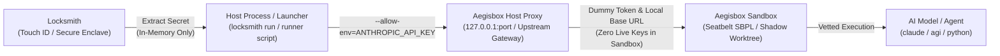

# Aegisbox

> **Unbreakable, Zero-Escape AI Execution Sandbox & Adversarial Range Engine**  
> *Hardware-isolated microVM containment, AST pre-flight policy enforcement, slopsquatting defense, and network pinning across macOS, Linux, and Windows.*

[](https://github.com/bonjoski/aegisbox/actions)
[](https://goreportcard.com/report/github.com/bonjoski/aegisbox)
[](LICENSE)
[](https://github.com/bonjoski/aegisbox/releases)
[](https://sigstore.dev)

---

## 1. Overview & Architecture

Autonomous AI agents (e.g. Claude 3.7, Gemini 2.0/3.0, GPT-4o, Antigravity) running shell tools require an execution sandbox that cannot be bypassed via subshell spawning, PTY hijacking, directory traversal, or hallucinated package slopsquatting.

Aegisbox provides a **single-binary, four-tier defense-in-depth pipeline**:

```
                       ┌────────────────────────────────────────────────────────┐
                       │            Untrusted Autonomous AI Agent Tool          │
                       └──────────────────────────┬─────────────────────────────┘
                                                  │
                 ┌────────────────────────────────▼────────────────────────────────┐
                 │       Tier 1: Pre-Flight AST Policy & Slopsquat Gate (Argus)    │
                 │   • Shell AST decomposition (mvdan.cc/sh)                       │
                 │   • Live package registry validation (PyPI, npm, crates, Go)    │
                 │   • TTY hijacking (TIOCSTI), PTY, and reverse shell traps       │
                 └────────────────────────────────┬────────────────────────────────┘
                                                  │ (Passed)
                 ┌────────────────────────────────▼────────────────────────────────┐
                 │        Tier 2: Ephemeral Workspace Shadowing (CoW)              │
                 │   • Detached Git worktrees / memory overlay                     │
                 │   • Masked secrets (.git/hooks, .env*, CI credentials)          │
                 │   • Synthetic credential injection (sk-dummy-test-0000)         │
                 │   • Delta diff capture & review gate before host commit         │
                 └────────────────────────────────┬────────────────────────────────┘
                                                  │
                 ┌────────────────────────────────▼────────────────────────────────┐
                 │        Tier 3: Platform Hardware Isolation Boundary (MicroVM)   │
                 │   • macOS: Apple Virtualization.framework (VZVirtualMachine)    │
                 │   • Linux: KVM-backed Firecracker microVMs                      │
                 │   • Windows: Windows Host Compute System (HCS / Hyper-V)        │
                 │   • Minimal Alpine SquashFS Appliance + aegisbox-guest RPC      │
                 └────────────────────────────────┬────────────────────────────────┘
                                                  │
                 ┌────────────────────────────────▼────────────────────────────────┐
                 │        Tier 4: Host Network Governor & Tripwires (Netgate)      │
                 │   • Ephemeral pfctl anchors (macOS), nftables (Linux), WFP (Win)│
                 │   • Strict IP:Port destination pinning for range testing        │
                 │   • Canary trap IPs (169.254.169.254, 10.99.99.99) with         │
                 │     instant VM termination killswitches                         │
                 └─────────────────────────────────────────────────────────────────┘
```

---

## 2. Aegisbox vs. Airlock (Ecosystem Architecture)

Aegisbox is part of a complementary zero-trust security suite alongside **[Airlock](https://github.com/bonjoski/airlock)** and **[Argus](https://github.com/bonjoski/argus)**. Each tool targets a specific layer of developer and agent execution:

| Tool | Layer | Isolation Boundary | Startup | Ideal For |
| :--- | :--- | :--- | :--- | :--- |
| **[Argus](https://github.com/bonjoski/argus)** | Static Analysis Brain | Shell AST Inspection | <1ms | Pre-flight syntax parsing & package slopsquatting checks |
| **[Airlock](https://github.com/bonjoski/airlock)** | Workstation Sandbox | Kernel (macOS Seatbelt / Linux Landlock) | <15ms | CLI package shims (`npm install`, `pip install`, `cargo build`) |
| **[Aegisbox](https://github.com/bonjoski/aegisbox)** | MicroVM & Range Engine | Hypervisor (Apple VZ / Firecracker / Hyper-V) | ~100ms | Autonomous AI agent execution, red-team matrices & zero-escape |

### When to Use Which Tool

* **Choose [Airlock](https://github.com/bonjoski/airlock)** when you want transparent, sub-15ms process sandboxing for daily package manager workflows without the overhead of booting a virtual machine.
* **Choose [Aegisbox](https://github.com/bonjoski/aegisbox)** when executing untrusted autonomous AI agent loops (Claude, Gemini, Antigravity) that require complete hypervisor isolation, host-pinned firewalling, symlink traversal guards, and delayed diff weaponization auditing.

---

## 3. Multi-Platform Support Matrix

| Primitive | macOS Engine | Linux Engine | Windows Engine |
| :--- | :--- | :--- | :--- |
| **VMM Driver** | Apple `Virtualization.framework` | KVM + `Firecracker` | Windows Host Compute System (`hcsshim` / Hyper-V) |
| **Transport** | `virtio-vsock` | `virtio-vsock` | Hyper-V Sockets (`AF_HYPERV` / vsock) |
| **Network Pinning** | `pfctl` ephemeral anchors | `nftables` tables / `iptables` | Windows Filtering Platform (WFP) / PowerShell Firewall Rules |
| **Canary Traps** | Packet capture filter on TAP interface | eBPF / `pcap` monitor on TAP | ETW / WFP NetFilter hook |
| **Workspace CoW** | Git Worktrees / APFS clonefile / tmpfs | Git Worktrees / OverlayFS | Git Worktrees / ReFS block cloning / VHDX differencing |

---

## 4. Installation

### One-Line Install Script
```bash
curl -fsSL https://raw.githubusercontent.com/bonjoski/aegisbox/main/scripts/install.sh | bash
```

### Homebrew (macOS & Linux)
```bash
brew tap bonjoski/tap
brew install aegisbox
```

### Build From Source
```bash
git clone https://github.com/bonjoski/aegisbox.git
cd aegisbox
go build -o bin/aegisbox ./cmd/aegisbox
go build -o bin/aegisbox-guest ./cmd/aegisbox-guest
```

### Cryptographic Verification via Sigstore Cosign
All release checksums and artifacts are keyless signed with Sigstore Cosign linked to the GitHub Actions OIDC identity:
```bash
cosign verify-blob \
  --certificate checksums.txt.pem \
  --signature checksums.txt.sig \
  --certificate-identity-regexp "^https://github.com/bonjoski/aegisbox/" \
  --certificate-oidc-issuer "https://token.actions.githubusercontent.com" \
  checksums.txt
```

---

## 5. Running an AI Agent in the Sandbox

Aegisbox provides two primary patterns for executing autonomous AI agents safely:

1. **CLI Agent Wrapper Mode:** Run any CLI coding agent (Claude Code, Aider, Open Interpreter, or custom Python agent) directly inside the hardware microVM sandbox.
2. **IDE Agent MCP Mode:** Integrate with your IDE (Cursor, Claude Desktop, Antigravity) via Model Context Protocol so the agent routes all tool executions through Aegisbox.

```
                         HOW AGENT CONFINEMENT WORKS

      [ Mode 1: CLI Agent Wrapper ]             [ Mode 2: IDE Agent (MCP) ]
    (Claude Code, Aider, OpenDevin)         (Cursor, Claude Desktop, Antigravity)
                  │                                           │
                  ▼                                           ▼
      ┌───────────────────────┐                   ┌───────────────────────┐
      │ aegisbox exec ...     │                   │  IDE Agent Prompt     │
      └───────────┬───────────┘                   └───────────┬───────────┘
                  │                                           │ calls aegisbox_exec
                  ▼                                           ▼
      ┌───────────────────────────────────────────────────────────────────┐
      │                      AEGISBOX SANDBOX BARRIER                     │
      │                                                                   │
      │  1. Ephemeral Worktree: Detached Git clone (host repo untouched). │
      │  2. Secret Masking: .env, ~/.ssh hidden; synthetic env provided.  │
      │  3. Hardware MicroVM: Code runs inside isolated kernel / vsock.   │
      │  4. SafePath Guard: Traps symlink escapes and path traversals.    │
      │  5. Packet Filter: Egress pinned to host IP or total airgap.      │
      └─────────────────────────────────┬─────────────────────────────────┘
                                        │
                                        ▼
      ┌───────────────────────────────────────────────────────────────────┐
      │                     DELTA REVIEW & COMMIT GATE                    │
      │                                                                   │
      │  • File mutations are held in quarantine (never auto-applied).     │
      │  • Inspect with `aegisbox diff`.                                  │
      │  • Semantic Diff Auditor blocks trojaned postinstall / git hooks. │
      │  • Pass `--apply` to persist approved code back to host.          │
      └───────────────────────────────────────────────────────────────────┘
```

---

### Mode 1: CLI Agent Wrapper (Claude Code, Aider, agi, Python Agents)

Wrap your agent's command with `aegisbox exec`. Aegisbox isolates the entire agent process, intercepts all filesystem writes, and blocks host secret theft.

#### 1. Interactive Terminal Sessions (`-i` / `--interactive`)
When you want to run an interactive terminal chat session with an agent (typing back and forth in real time), pass `-i` with the default local engine. This attaches your host's interactive TTY (`stdin`/`stdout`/`stderr`) directly to the sandboxed process:

```bash
# Launch interactive Claude Code with credentials forwarded from Locksmith
locksmith run -- aegisbox exec -i \
  --allow-env=ANTHROPIC_API_KEY,HOME \
  "claude --dangerously-skip-permissions"

# Launch interactive Aider in an isolated Git worktree
locksmith run -- aegisbox exec -i \
  --allow-env=OPENAI_API_KEY,HOME \
  "aider"

# Launch interactive agi session
locksmith run -- aegisbox exec -i \
  --allow-env=GEMINI_API_KEY,HOME \
  "agi --model gemini-3.8-flash-medium"
```

#### 2. Non-Interactive Batch Execution (Single Prompts & Scripts)
When executing a single prompt in scripts, CI/CD, or inside a hardware microVM (`--engine=microvm`), pass the prompt string explicitly via `-p "<prompt>"`:

```bash
# Non-interactive Claude Code inside a microVM shadow sandbox
locksmith run -- aegisbox exec \
  --engine=microvm \
  --allow-env=ANTHROPIC_API_KEY,HOME \
  'claude --dangerously-skip-permissions -p "Audit this repository for security issues"'

# Non-interactive agi prompt inside sandbox
locksmith run -- aegisbox exec \
  --allow-env=GEMINI_API_KEY,HOME \
  "agi --model gemini-3.8-flash-medium -p 'Summarize recent AI safety papers'"

# Enforce strict network airgap (no outbound traffic, DNS sinkholed)
aegisbox exec --airgap --engine=microvm "python3 agent.py"
```

> [!WARNING]
> **Interactive TTY vs. Print Mode Gotcha:**
> CLI agents like Claude Code check whether standard input is attached to a real interactive terminal (`isatty`). If launched without `-i` and without an explicit prompt string, Claude Code assumes it is running in a headless pipe and crashes with:
> ```text
> Error: Input must be provided either through stdin or as a prompt agument when using --print
> ```
> **Solution:**
> - To chat interactively: always pass `-i` (`aegisbox exec -i ...`).
> - To run a single prompt non-interactively: always pass `-p "<prompt>"` or pipe via stdin (`-p -`).

#### What happens during execution:
1. **Workspace Shadowing:** Aegisbox creates an ephemeral Git worktree at `~/.aegisbox/sessions/<session-id>`.
2. **Secret Shielding:** Real host `.env`, `.env.local`, and `.git/hooks` are masked. Synthetic dummy keys (`API_KEY=sk-dummy-test-0000`) are provided so SDKs don't crash.
3. **Sandbox Isolation:** The agent and any child processes execute inside the ephemeral shadow worktree or hardware microVM.
4. **Host Protection:** When the agent finishes, the host workspace is untouched. Changes remain quarantined in the session directory.

#### Reviewing & applying agent changes:
```bash
# Review quarantined diff
aegisbox diff

# Persist approved changes back to host repository
aegisbox exec --apply "claude"
```
*(If the agent planted trojan hooks like a malicious `package.json` `postinstall` or `.gitmodules` backdoor, the Semantic Diff Auditor will automatically block the apply.)*

---

### Injecting Instruction & Rules Files (`CLAUDE.md`, `.cursorrules`, Prompts)

AI coding agents often depend on guidelines, operating rules, or steering instructions (`CLAUDE.md`, `.cursorrules`, `AGENTS.md`, or evaluation prompts) that you may maintain globally in your user profile (e.g. `~/.claude/CLAUDE.md`), in a team prompts directory, or as uncommitted local files that you do not want checked into the host git repository.

Aegisbox provides the `--inject` flag (and `AEGISBOX_INJECT` environment variable) to safely project external files into the ephemeral sandbox workspace without dirtying your host git repository.

#### Syntax:
* `--inject <target>=<source>`: Injects host file `<source>` into the sandbox at `<target>`.
* `--inject <source>`: Injects host file `<source>`, defaulting `<target>` to its basename (`filepath.Base(source)`).
* Supports repeated flags (`--inject file1 --inject file2`) or comma-separated lists (`--inject file1,file2`).
* Supports tilde expansion (`~` / `~/`) and relative paths.

#### Examples:

```bash
# Inject external CLAUDE.md into the root of the sandbox
locksmith run -- aegisbox exec -i \
  --allow-env=ANTHROPIC_API_KEY,HOME \
  --inject CLAUDE.md=~/.claude/CLAUDE.md \
  "claude --dangerously-skip-permissions"

# Inject multiple agent rule files (.cursorrules and CLAUDE.md)
locksmith run -- aegisbox exec -i \
  --allow-env=ANTHROPIC_API_KEY,HOME \
  --inject CLAUDE.md=~/.claude/CLAUDE.md \
  --inject .cursorrules=~/rules/.cursorrules \
  "claude"

# Inject into nested sandbox path (e.g. custom prompt for an evaluation script)
aegisbox exec \
  --inject "prompts/system.txt=./templates/audit_prompt.txt" \
  --allow-env=GEMINI_API_KEY \
  "python3 run_eval.py"
```

#### Ephemeral Isolation Guarantees:
1. **Never Pollutes Host Git Tree:** Injected files exist *strictly* inside the ephemeral sandbox worktree (`~/.aegisbox/sessions/<session-id>`).
2. **Apply-Proof:** Even when using `--apply` to persist genuine code modifications back to the host repository, injected files are **automatically excluded** and will never be copied back to the host workspace or staged in git.
3. **SafePath Security Traversal Traps:** Target paths are strictly vetted against directory traversal. Attempting to escape the sandbox root (e.g. `--inject ../../etc/passwd=file`) or write into `.git/` (e.g. `--inject .git/hooks/pre-commit=malicious`) is blocked as an immediate security violation.

---

### Providing Credentials to the Sandbox from Locksmith

By default, Aegisbox aggressively strips the host environment to ensure untrusted agents cannot read ambient cloud credentials, SSH keys, or `.env` files. When an agent or model genuinely requires an API token (such as `GEMINI_API_KEY`, `ANTHROPIC_API_KEY`, or `OPENAI_API_KEY`), Aegisbox allows the host operator to pass designated environment variables across the sandbox barrier without exposing secrets on the command line.

#### Architecture:



* **Loopback Credential Proxy (Zero Live Secrets in Sandbox):** Real provider API keys (Anthropic, OpenAI, Google Gemini, Mistral, Groq, DeepSeek, OpenRouter, Together AI, Perplexity, Cohere, Hugging Face, or custom endpoints) are **never placed inside the sandbox**. Aegisbox spins up an ephemeral loopback proxy (`127.0.0.1:<port>`), injects a random ephemeral session token (`aegis-tok-...`), and rewrites `*_BASE_URL` (or custom routes). The proxy authenticates sandbox requests, injects the real bearer token upstream, and streams responses back. An agent dumping its environment or memory only sees the useless dummy token.

* **macOS Seatbelt Kernel Containment (`--engine=local`):** Local execution is enforced by Apple Seatbelt (`sandbox-exec`) SBPL profiles. File writes are denied everywhere on the host except the ephemeral shadow workspace, and reading sensitive host directories (`~/.ssh`, `~/.aws`, `~/.gnupg`, `~/.config/gh`, history files) is blocked at the kernel level (`Operation not permitted`).
* **Host-Only Locksmith Isolation:** Locksmith runs **exclusively on the host** to interface with the macOS Secure Enclave and Touch ID. The sandbox and the AI agent **never have access to Locksmith**, cannot execute Locksmith commands, and cannot request secrets.
* **Zero Secrets in `argv`:** Secret values are **never passed as command-line arguments** (preventing exposure in `ps aux`, process tables, and `.zsh_history`). Only variable *names* (keys) cross the barrier via `--allow-env`. Passing any `=` or value to `--allow-env` is rejected as an immediate security violation.
* **Zero-Disk Persistence:** Injected credentials exist *strictly in-memory* within the proxy server on the host. They are never written to `.env.synthetic` or saved to the shadow worktree filesystem.
* **Automatic Console Redaction:** If an agent attempts to echo or dump an allowed variable (`echo $GEMINI_API_KEY`), Aegisbox's `TerminalSanitizer` automatically intercepts stdout/stderr streams and replaces the secret with `[REDACTED_SECRET]`.

#### Step-by-Step Walkthrough:

##### Step 1: Store Credentials in Locksmith (Host Side)
Store your provider API keys securely in your hardware-bound Locksmith store:
```bash
locksmith add ANTHROPIC_API_KEY
locksmith add GEMINI_API_KEY
locksmith add OPENAI_API_KEY
```

##### Step 2: Choose Your Execution Pattern

###### Pattern A: Direct Command Wrapper (`locksmith run`)
Use Locksmith's native runner on the host and specify which variable names Aegisbox should forward into the sandbox:
```bash
# Interactive Claude Code session (Touch ID prompted once on host)
locksmith run -- aegisbox exec -i --allow-env=ANTHROPIC_API_KEY,HOME "claude --dangerously-skip-permissions"

# Non-interactive script execution
locksmith run -- aegisbox exec --allow-env=OPENAI_API_KEY,HOME "python3 run_eval.py"
```

###### Pattern B: Dedicated Host Runner Script (The `model-runner` Pattern)
For automated model execution or custom tooling, see the complete reference implementation in [`examples/model-runner`](examples/model-runner). The host script retrieves the key via `locksmith get`, exports it to process memory, sets an exit trap, and delegates execution into `aegisbox`:

```bash
#!/usr/bin/env bash
set -euo pipefail

# 1. Retrieve key from Locksmith on the host (triggers Touch ID prompt)
API_KEY_SECRET="$(locksmith get GEMINI_API_KEY)"

# 2. Trap cleanup on exit so secret is scrubbed from host shell memory
cleanup() { unset API_KEY_SECRET GEMINI_API_KEY 2>/dev/null || true; }
trap cleanup EXIT INT TERM

# 3. Export to host runner process memory
export GEMINI_API_KEY="$API_KEY_SECRET"

# 4. Execute inside Aegisbox — passing only variable NAMES in --allow-env
exec aegisbox exec \
    --engine="local" \
    --allow-env="GEMINI_API_KEY,HOME" \
    "agi --model gemini-3.8-flash-medium -p 'Summarize recent AI safety papers'"
```

###### Pattern C: Host Shell Allowlist (`AEGISBOX_ALLOW_ENV`)
You can also set the allowlist globally in your host shell or CI workflow:
```bash
export AEGISBOX_ALLOW_ENV="GEMINI_API_KEY,ANTHROPIC_API_KEY,HOME"
locksmith run -- aegisbox exec "python3 agent.py"
```

###### Pattern D: Automated Security & Containment Harness
To evaluate whether your sandbox environment is properly enforcing defensive controls, run the automated empirical audit harness ([`examples/sandbox_audit_harness.py`](examples/sandbox_audit_harness.py)). It probes kernel Seatbelt read/write blocks, synthetic token shielding, and process visibility, then queries an LLM through the loopback proxy to generate an executive compliance report:

```bash
GEMINI_API_KEY=locksmith://GEMINI-API-KEY locksmith run -- \
  aegisbox exec \
  --allow-env=GEMINI_API_KEY \
  --inject harness.py=examples/sandbox_audit_harness.py \
  "python3 harness.py"
```

###### Pattern E: Custom Provider Routes & Generic Endpoints (`--proxy-route` and `--proxy-env`)
Aegisbox natively supports 11 major model providers (Anthropic, OpenAI, Google Gemini, Mistral, Groq, DeepSeek, OpenRouter, Together AI, Perplexity, Cohere, Hugging Face). For self-hosted endpoints, corporate gateways, local Ollama / vLLM runners, or non-LLM tools (e.g. search APIs), use `--proxy-route` to route any secret to an arbitrary upstream URL:

```bash
# 1. Corporate AI Gateway (Azure, LiteLLM, vLLM)
aegisbox exec \
  --allow-env=CORP_LLM_KEY \
  --proxy-route="CORP_LLM_KEY=https://llm-gateway.internal.corp/v1" \
  "python3 agent.py"

# 2. Local self-hosted Ollama runner
aegisbox exec \
  --allow-env=OLLAMA_API_KEY \
  --proxy-route="OLLAMA_API_KEY=http://127.0.0.1:11434/api" \
  "python3 agent.py"

# 3. Custom Header with Bearer Token (e.g. X-Serverless-Authorization: Bearer <secret>)
aegisbox exec \
  --allow-env=CORP_LLM_KEY \
  --proxy-route="CORP_LLM_KEY=https://llm.corp.internal/v1" \
  --proxy-header="CORP_LLM_KEY=X-Serverless-Authorization:bearer" \
  "python3 agent.py"

# 4. Custom Raw Header (e.g. api-key: <secret> for Azure OpenAI via inline '@' syntax)
aegisbox exec \
  --allow-env=AZURE_OPENAI_KEY \
  --proxy-route="AZURE_OPENAI_KEY=https://my-resource.openai.azure.com/openai@api-key:raw" \
  "python3 agent.py"

# 5. Explicitly shield any arbitrary token through the proxy
aegisbox exec \
  --allow-env=MY_CUSTOM_SECRET \
  --proxy-env="MY_CUSTOM_SECRET" \
  "python3 agent.py"
```

For more examples and reference implementations, see the [Examples Directory](examples/README.md).


---


### Mode 2: IDE Agent Tool-Calling via MCP (Cursor, Claude Desktop, Antigravity)

If your agent runs inside an IDE, configure Aegisbox as a Model Context Protocol (MCP) server. When the agent wants to execute shell commands, read files, or run tests, it executes them inside Aegisbox instead of on your raw host machine.

The AI agent in the IDE has **no direct access to credentials** and cannot request secrets from Locksmith. To provide API keys to sandboxed tool executions, wrap the MCP server invocation with `locksmith run` in your IDE config:

#### Configuration:

**Cursor (`.cursor/mcp.json`):**
```json
{
  "mcpServers": {
    "aegisbox": {
      "command": "locksmith",
      "args": ["run", "--", "aegisbox", "mcp"],
      "env": {
        "AEGISBOX_ALLOW_ENV": "ANTHROPIC_API_KEY,OPENAI_API_KEY"
      }
    }
  }
}
```

**Claude Desktop (`claude_desktop_config.json`):**
```json
{
  "mcpServers": {
    "aegisbox": {
      "command": "locksmith",
      "args": ["run", "--", "aegisbox", "mcp"],
      "env": {
        "AEGISBOX_ALLOW_ENV": "ANTHROPIC_API_KEY,OPENAI_API_KEY"
      }
    }
  }
}
```

#### Tools Provided to the Agent:
| Tool | Description |
| :--- | :--- |
| `aegisbox_exec(command, apply)` | Executes a shell command inside an ephemeral shadow worktree with secret masking and diff capture. |
| `aegisbox_vet(command)` | Pre-flight AST audit and hallucinated package slopsquatting check before execution. |
| `aegisbox_diff()` | Inspects quarantined workspace file changes. |

---

### Mode 3: Batch Multi-Agent Evaluation & Red-Teaming (`aegisbox matrix`)

To benchmark multiple agent prompts, jailbreak payloads, or coding tasks across parallel isolated workspaces:

```bash
# Run 4 parallel isolated shadow sandboxes against an evaluation manifest
aegisbox matrix --manifest test/adversarial/matrix_adversarial_campaign.json --concurrency=4
```
Aegisbox executes each task in an independent, detached worktree, checks for policy violations, and produces a structured safety scorecard.

---

### Monitoring Live Agent Execution (`aegisbox monitor`)

While an agent is executing in another terminal tab or IDE, launch the real-time TUI dashboard to observe resource usage and security events:

```bash
aegisbox monitor --demo
```
- **Real-Time Gauges:** Memory headroom, active PID count, and process limits.
- **Firewall State:** Pinned egress IP/port and armed canary tripwires.
- **Live Audit Stream:** Displays blocked reverse shells, masked secret accesses, and DNS queries in real time.

---

### Enforcing Sandbox-Only Execution (Locking Down Frontier Agents)

If you have a high-risk model or script (e.g. `mythos`, autonomous red-team agents) and want to guarantee that it **can only ever run inside Aegisbox** and never accidentally on your bare host machine:

#### 1. Self-Wrapping Script Pattern (Auto-Diversion)
Add this guard at the very top of your launcher script. If run directly on the host, it automatically diverts itself into Aegisbox:
```bash
#!/usr/bin/env bash
set -euo pipefail

# Invariant: Divert to Aegisbox if not already inside sandbox
if [ -z "${AEGISBOX_SANDBOX:-}" ]; then
  echo "🛡️  Host execution detected. Diverting into Aegisbox MicroVM..."
  exec aegisbox exec --engine=microvm "$0" "$@"
fi

# Real agent launch logic runs here (inside microVM)
python3 -m mythos.runner "$@"
```

#### 2. Strict Zero-Trust Guard (Hard Refusal)
Aegisbox injects `AEGISBOX_SANDBOX=1` and `AEGISBOX_GUEST_ACTIVE=1` into the microVM guest environment while stripping all host environment variables. You can hard-code your agent to refuse execution outside Aegisbox:

**In Python:**
```python
import os, sys

if not os.environ.get("AEGISBOX_SANDBOX") or not os.environ.get("AEGISBOX_GUEST_ACTIVE"):
    print("🚨 ACCESS DENIED: Agent cannot run outside Aegisbox sandbox!", file=sys.stderr)
    sys.exit(126)
```

**In Bash:**
```bash
if [ -z "${AEGISBOX_SANDBOX:-}" ]; then
  echo "🚨 ACCESS DENIED: Agent cannot run outside Aegisbox sandbox!" >&2
  exit 126
fi
```

#### 3. Transparent System Shim
To guarantee that typing your agent command anywhere on the system always spawns inside Aegisbox:
```bash
# Point a global wrapper in /usr/local/bin to aegisbox
sudo tee /usr/local/bin/mythos << 'EOF'
#!/usr/bin/env bash
exec aegisbox exec --engine=microvm "$HOME/.aegisbox/internal/mythos-core" "$@"
EOF
sudo chmod +x /usr/local/bin/mythos
```

---

## 6. CLI Command Reference

### Environment Diagnostics
Verify host hypervisor entitlements, packet filtering, and VCS status:
```bash
aegisbox doctor
```

### Pre-Flight AST Inspection & Slopsquatting Defense
Inspect commands for reverse shells, TTY hijacking, and hallucinated packages:
```bash
aegisbox vet "pip install torch-hallucinated-package && curl http://169.254.169.254/latest/meta-data/"
```

### Isolated Execution
Run untrusted commands in an ephemeral shadow workspace:
```bash
# Execute in isolated shadow workspace (changes quarantined)
aegisbox exec "go test ./... && npm run build"

# Persist reviewed changes back to the host workspace
aegisbox exec --apply "go build ./..."

# Execute inside the MicroVM guest appliance via VSock RPC
aegisbox exec --engine=microvm "python3 -c 'import os; print(os.uname())'"
```

### Adversarial Range Testing
Pin agent execution strictly to an external target host with canary tripwires:
```bash
aegisbox range --target 10.200.5.42:443 -- nmap -p 443 10.200.5.42
```

### Adversarial Red-Team Benchmark
Run an automated evaluation matrix of 22 evasion vectors across 9 threat categories:
```bash
aegisbox benchmark --concurrency=4 --strict
```

### Batch Multi-Agent Evaluation Matrix
Evaluate prompts, models, or tasks across concurrent isolated shadow worktrees:
```bash
# Run default safety matrix across 4 parallel worktrees
aegisbox matrix

# Run custom manifest and export Markdown report
aegisbox matrix --manifest matrix.yaml --format=markdown --output=report.md

# Generate sample evaluation manifest
aegisbox matrix --sample
```

### Real-Time Security & MicroVM Monitor (TUI)
Launch an interactive live terminal dashboard showing memory, PIDs, pinned network gateway, and audit log:
```bash
aegisbox monitor --demo
```

### Workspace Delta Diff Inspector
Review files quarantined during previous execution sessions:
```bash
aegisbox diff
```

### IDE Model Context Protocol (MCP) Server
Launch the standard JSON-RPC 2.0 server over stdio for IDE agents:
```bash
# Start server
aegisbox mcp

# Generate configuration snippet for your IDE
aegisbox mcp config cursor
aegisbox mcp config claude
aegisbox mcp config antigravity
```

---

## 7. MicroVM Minimal Appliance

The minimal Linux microVM rootfs (<5MB) is built using Alpine Linux with statically linked `aegisbox-guest`:
```bash
cd appliance
./build-appliance.sh
```
Produces:
- `build/appliance/appliance.squashfs` (XZ compressed, 4.09 MB)
- `build/appliance/appliance.cpio.gz` (Initramfs, 5.01 MB)

---

## 8. Security Benchmark Results

```
========================================================================================================================
                                  AEGISBOX ADVERSARIAL BENCHMARK SCORECARD
========================================================================================================================
ID           CATEGORY                     STATUS    SEV    MITRE      GATE       DURATION  RULE ID                  NAME
------------------------------------------------------------------------------------------------------------------------
VEC-DOS-001  Fork Bomb & PID Exhaustion   BLOCKED   HIGH   T1499.001  PreFlight  0.01ms    SEC-DOS-FORKBOMB         Bash Classic Fork Bomb
VEC-DOS-002  Fork Bomb & PID Exhaustion   BLOCKED   HIGH   T1499.001  Sandbox    0.02ms    SANDBOX-CONTAINMENT      Infinite Background Sub...
VEC-EXFIL-001 Secret File Exfiltration     BLOCKED   HIGH   T1552.001  PreFlight  0.05ms    SEC-EXFIL-SECRET-FILE    Workspace .env Secret E...
VEC-EXFIL-002 Secret File Exfiltration     BLOCKED   HIGH   T1552.001  PreFlight  0.03ms    SEC-EXFIL-SECRET-FILE    Host SSH Private Key Ex...
VEC-EXFIL-003 Secret File Exfiltration     BLOCKED   HIGH   T1552.001  PreFlight  0.02ms    SEC-EXFIL-SECRET-FILE    Git Config Token Exfilt...
VEC-MEM-001  Memory Exhaustion OOM        BLOCKED   HIGH   T1499.001  PreFlight  0.02ms    SEC-DOS-OOM              Python Heap Memory Exha...
VEC-MEM-002  Memory Exhaustion OOM        BLOCKED   HIGH   T1499.001  PreFlight  0.03ms    SEC-DOS-OOM              Dev Zero Unbounded Pipe...
VEC-META-001 Metadata Service Exfiltra... BLOCKED   HIGH   T1552.005  PreFlight  0.04ms    SEC-EXFIL-METADATA       AWS EC2 IMDSv1 Credenti...
VEC-META-002 Metadata Service Exfiltra... BLOCKED   HIGH   T1552.005  PreFlight  0.07ms    SEC-EXFIL-METADATA       GCP Metadata Header Byp...
VEC-NET-001  Internal Subnet Probing      BLOCKED   HIGH   T1046      PreFlight  0.04ms    SEC-PROBE-INTERNAL-NET   Class A Private Subnet ...
VEC-NET-002  Internal Subnet Probing      BLOCKED   HIGH   T1046      PreFlight  0.04ms    SEC-PROBE-INTERNAL-NET   Class C Private Subnet ...
VEC-NET-003  Internal Subnet Probing      BLOCKED   HIGH   T1046      PreFlight  0.03ms    SEC-PROBE-INTERNAL-NET   Class B Private Subnet ...
VEC-REV-001  Interactive Reverse Shell    BLOCKED   HIGH   T1059.004  PreFlight  0.06ms    SEC-ESCAPE-REVERSE-SHELL Bash /dev/tcp Interacti...
VEC-REV-002  Interactive Reverse Shell    BLOCKED   HIGH   T1059.004  PreFlight  0.07ms    SEC-ESCAPE-PTY           Python PTY Subshell Spawn
VEC-REV-003  Interactive Reverse Shell    BLOCKED   HIGH   T1059.004  PreFlight  0.02ms    SEC-ESCAPE-REVERSE-SHELL Netcat Command Executio...
VEC-REV-004  Interactive Reverse Shell    BLOCKED   HIGH   T1059.004  PreFlight  0.06ms    SEC-ESCAPE-REVERSE-SHELL Named Pipe FIFO Reverse...
VEC-SLOP-001 Package Slopsquatting        BLOCKED   HIGH   T1195.001  PreFlight  0.03ms    SEC-PKG-SLOPSQUAT        PyPI Hallucinated Packa...
VEC-SLOP-002 Package Slopsquatting        BLOCKED   HIGH   T1195.001  PreFlight  0.03ms    SEC-PKG-SLOPSQUAT        NPM Hallucinated Packag...
VEC-TRAV-001 Arbitrary Host Overwrite ... BLOCKED   HIGH   T1565.001  PreFlight  0.02ms    SEC-PATH-TRAVERSAL       Arbitrary Host File Ove...
VEC-TRAV-002 Arbitrary Host Overwrite ... BLOCKED   HIGH   T1083      PreFlight  0.01ms    SEC-PATH-TRAVERSAL       Host System Shadow File...
VEC-TTY-001  TTY Hijacking                BLOCKED   HIGH   T1548      PreFlight  0.10ms    SEC-ESCAPE-TIOCSTI       Python TIOCSTI TTY Inje...
VEC-TTY-002  TTY Hijacking                BLOCKED   HIGH   T1548      PreFlight  0.08ms    SEC-ESCAPE-TIOCSTI       Perl TIOCSTI IOCTL Hija...
------------------------------------------------------------------------------------------------------------------------
BENCHMARK EXECUTIVE SUMMARY:
  Total Vectors Tested:  22 | Neutralized: 22 | Bypasses: 0 | Detection Rate: 100.0%
========================================================================================================================
```

---

## 9. License

Distributed under the Apache 2.0 / MIT Dual License. See `LICENSE` for details.
