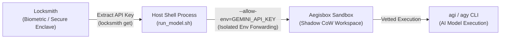

# Model Runner with Aegisbox & Locksmith

A secure execution pipeline for running AI models and agent CLI tools (`agi` / `agy` / `claude`) inside an isolated [Aegisbox](../../README.md) sandbox while fetching hardware-bound biometric credentials from [Locksmith](https://github.com/bonjoski/locksmith).

## Architecture



1. **Hardware-bound Credential Storage**: Secrets are stored encrypted with Touch ID / Biometrics via `locksmith`.
2. **Pre-flight Security Vetting**: Commands are analyzed by Aegisbox's Argus engine to block dangerous reverse shells, exfiltration vectors, or prompt-injected payload traps.
3. **Ephemeral Sandboxing**: The model runner runs in an isolated, copy-on-write shadow workspace.
4. **Environment Isolation**: Aegisbox strips all host environment variables by default. Only explicitly specified variables (e.g. `--allow-env=GEMINI_API_KEY,HOME`) are forwarded into the sandbox. Sensitive values are scrubbed upon exit.
5. **Ephemeral File Injection**: Easily inject `CLAUDE.md`, `.cursorrules`, or custom prompt files without committing them to the host repo.

---

## Quick Start

### 1. Store your API Key in Locksmith

```bash
# Add your Gemini or provider API key
locksmith add GEMINI_API_KEY
```

### 2. Run a Model Prompt

```bash
# Run a prompt non-interactively
./run_model.sh -p "Summarize the latest developments in quantum cryptography"
```

### 3. Launch an Interactive Session

```bash
./run_model.sh -i
```

### 4. Custom Model & Keys

```bash
# Store Anthropic key
locksmith add ANTHROPIC_API_KEY

# Run with Claude
./run_model.sh \
  -k ANTHROPIC_API_KEY \
  -e ANTHROPIC_API_KEY \
  -m claude-sonnet-4-6 \
  -p "Explain the Raft consensus algorithm"
```

### 5. Injecting Agent Instructions (`CLAUDE.md`, `.cursorrules`)

```bash
# Inject external instructions into the sandbox root
./run_model.sh -i -j CLAUDE.md=~/.claude/CLAUDE.md

# Or inject directly by source path (defaults destination to basename)
./run_model.sh -i -j /path/to/CLAUDE.md
```

---

## Options & Flags

| Flag | Description | Default |
| --- | --- | --- |
| `-k, --key <name>` | Key identifier to retrieve from Locksmith | `GEMINI_API_KEY` |
| `-e, --env-var <name>` | Environment variable name to forward into sandbox | `GEMINI_API_KEY` |
| `-m, --model <model>` | Model ID to launch | `gemini-3.8-flash-medium` |
| `-p, --prompt <text>` | Non-interactive prompt string | `""` |
| `-i, --interactive` | Launch `agi` in interactive mode | `0` |
| `-j, --inject <path>` | Inject host file into sandbox (e.g. `CLAUDE.md=~/.claude/CLAUDE.md`) | `[]` |
| `--engine <engine>` | Aegisbox sandbox engine (`local` or `microvm`) | `local` |
| `-- <args...>` | Forward custom flags directly to `agi` | `[]` |
